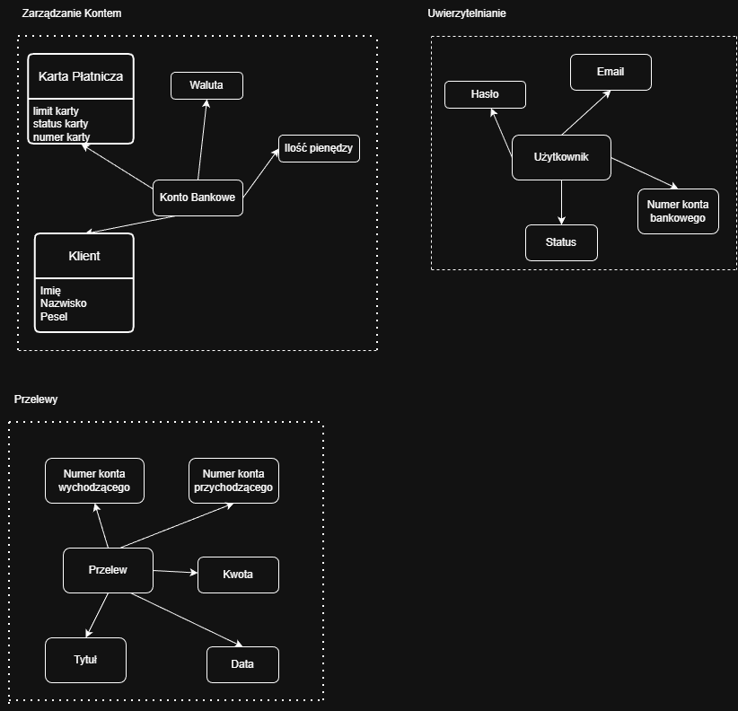

# Zadanie 1 - Domain Driven Design

### Maciej Pietrewicz

Celem zadania jest zamodelowanie bezpiecznej aplikacji bankowej wykorzystując fragmenty Domain Driven Design. W ramach zadania zaprojektowno i zdefiniowano aplikację składającą się z zarządzania kontem, przelewów oraz uwierzytelniania.

## Bounded Contexts
- **Zarządzanie Kontem**
- **Przelewy**
- **Uwierzytelnianie**

## Model Domeny

## Agregaty i Encje

1. Kontekst Zarządzanie Kontem zawiera agregat konto bankowe
    - Znajdują tu się dwie encje karta płatnicza oraz klient.
    - Klient zawiera atrybuty imię, nazwisko i pesel jako `11` cyfr.
    - Karta płatnicza zawiera limit karty w postaci wartości i odnoszący się do waluty konta, status karty jako `aktywna` lub `zablokowana`, a także numer karty w odpowiednim formacie.
    - Istnieją tu dodatkowo trzy obiekty wartości jak waluta określona jako np. `PLN` lub `EUR`, a także ilość pieniędzy na koncie, które nie może wynosić mniej niż `0`.
    - Możliwe są opercję zmiany limitu karty, statusu karty, podejrzenie innych kont walutowych.

2. Przelewy
    - Zawiera on 5 obiektów wartości
    - Numer konta wychodzącego jak i przychodzącego odnosi się do id nadanemu kontu bankowemu, i określa jakie konta biorą udział w transakcji.
    - Kwota przelewu nie może być większa niż ilość pieniędzy na koncie z którego wychodzi przelew.
    - Data przelewu może być aktualna lub przyszła (przy przelewie zleconym na konkretną datę) i określona odpowiednim formatem np. `DD.MM.YYYY`
    - Tytuł przelewu może zawierać liczby lub litery.
    - Umożliwia wykonanie operacji przelewu i podgląd wykonanych przelewów

2. Uwierzytelnianie
    - Zawiera 4 obiekty wartości
    - Hasło odpowiedniej długości np. z więcej niż `osiem znaków`, z wymuszonymi minimum `trzema liczbami` oraz z `dwoma znakami specjalnymi`.
    - Email użytkownika w formacie z `@`.
    - Status konta określa czy jest `aktywne` czy `zawieszone`
    - Umożliwia logowanie do konta i jest powiązany z id konta.

